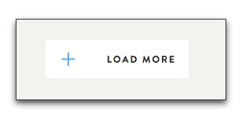

# Smart Background

A common use case for this is to place an icon as part of a link or button as seen here:

In this example the code looks like this:

    $gap: 40px;
    $horizontal_position: 10px;
    a.white-button {
      @include svg-smart-bg('add--blue', $horizontal_position center, $gap);
    }

** Note: There are alot of examples found in the `tests` directory.**

## Explained

1. `add-blue` is the filename (without extension)for two files in the `images` directory, where the png version is the fallback.

        images/add-blue.svg
        images/add-blue.png
        
### The gap
The gap creates space between the edge of the icon and the content of the element; in this case the _Load More_ text.  Technically speaking, it applies padding to the element equal to the gap plus the width of the icon.

In this example the code looks like this:

    $gap: 40px;
    $horizontal_position: 0;
    a.white-button {
      @include svg-smart-bg('add--blue', $horizontal_position center, $gap);
    }

### Horizontal position
With a pixel value the location is taken as that many pixels from the left edge of the element.  This is default for `background position`.

To move it to the right side you just need to switch to the [four value background positioning](http://caniuse.com/#feat=css-background-offsets) of css3 like this:

    $gap: 40px;
    $horizontal_position: 0;
    a.white-button {
      @include svg-smart-bg('add--blue', right $horizontal_position center, $gap);
    }
